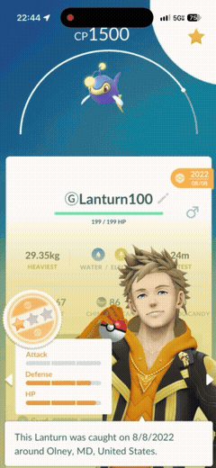
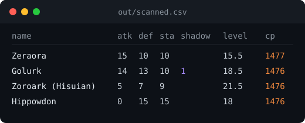

# Pokemon GO Video-to-CSV 📹

<p align="center">
  
</p>

That swipe becomes these rows:

<p align="center">
  
</p>

Take a screen recording of your Pokemon GO box (appraisal panel open,
swiping from Pokemon to Pokemon) and turn it into a collection CSV:
`name,atk,def,sta,shadow,level,cp`. 

Use in tandem with 
[pogo-gbl-team-generator](https://github.com/Gidntsquia/pogo-gbl-team-generator),
which reads the CSV this makes and figures out the best GO Battle League
teams you can build from it.

## Quickstart 🚀

1. Record yourself swiping through your box with the **Appraise** panel
   open, resting about a second on each Pokemon.
2. Run this (needs Node ≥ 18 either way; see
   [Setup](https://github.com/Gidntsquia/pokemon-go-video-to-csv/wiki/Setup)
   for details like the Windows OCR language pack):

**macOS**
```
xcode-select --install   # if you haven't already
git clone https://github.com/Gidntsquia/pokemon-go-video-to-csv
cd pokemon-go-video-to-csv
npm run setup                # grabs pvpoke's engine + data, needed after every fresh clone
scripts/scan.sh my-box.mp4   # scans to out/my-box.csv
```

**Windows / WSL2**
```
winget install -e --id Gyan.FFmpeg   # then reopen your terminal (WSL2: apt install ffmpeg works too)
git clone https://github.com/Gidntsquia/pokemon-go-video-to-csv
cd pokemon-go-video-to-csv
npm run setup                # grabs pvpoke's engine + data, needed after every fresh clone
scripts/scan.sh my-box.mp4   # scans to out/my-box.csv
```

A couple other things you can do:

```
node scripts/scan-video.mjs my-box.mp4 --out out/scanned.csv --interval 0.5
node scripts/verify.mjs out/scanned.csv reference.csv   # check a scan against a CSV you hand-checked
```

## What it does 🔬

- Works on macOS (AVFoundation + Vision) and Windows/WSL2 (ffmpeg + the
  Windows OCR that's already built in) — nothing extra to install for OCR
  on either one.
- Figures out form automatically.
- Picks up shadow Pokemon (sliver of purify button + shadowy flame recognition).
- Looks at every frame a Pokemon shows up in (not just one) to settle on
  its CP and IVs.
- Double-checks every row against pvpoke's own CP/level math before writing
  it — anything that doesn't add up gets flagged as a warning instead of
  going in quietly.
- Takes roughly half as long as the recording itself to scan.

## Documentation 📚

More detail is in the
[wiki](https://github.com/Gidntsquia/pokemon-go-video-to-csv/wiki):

- [Setup](https://github.com/Gidntsquia/pokemon-go-video-to-csv/wiki/Setup) — platform requirements, ffmpeg, Windows OCR
- [Recording and Reading](https://github.com/Gidntsquia/pokemon-go-video-to-csv/wiki/Recording-and-Reading) — how to record, what each CSV column comes from
- [How CP, Level, Form and Shadow Are Figured Out](https://github.com/Gidntsquia/pokemon-go-video-to-csv/wiki/How-CP-Level-Form-and-Shadow-Are-Solved) — the math trick behind level/form, and the shadow heuristic
- [Options](https://github.com/Gidntsquia/pokemon-go-video-to-csv/wiki/Options) — full `scan-video.mjs` flag list
- [How It Works](https://github.com/Gidntsquia/pokemon-go-video-to-csv/wiki/How-It-Works) — macOS vs. Windows/WSL2 split, code layout
- [Development and Tests](https://github.com/Gidntsquia/pokemon-go-video-to-csv/wiki/Development-and-Tests) — running `npm test`, what the fixtures cover
- [Known Limitations](https://github.com/Gidntsquia/pokemon-go-video-to-csv/wiki/Known-Limitations)

## License 📄

[MIT](LICENSE). The vendored CP/level math ([pvpoke](https://github.com/pvpoke/pvpoke))
is also MIT-licensed and is downloaded at setup rather than distributed here.
